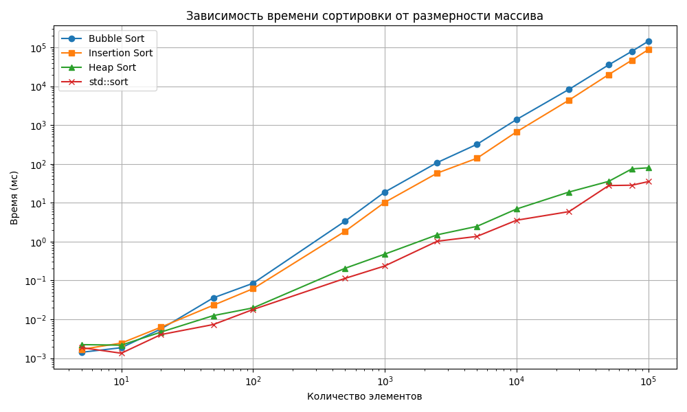

# Лабораторная работа №1: Тестирование и сравнение алгоритмов сортировки для записей пассажиров авиакомпании

Данный проект представляет собой реализацию и анализ эффективности различных алгоритмов сортировки на языке C++. В качестве тестовых данных используется массив структур, содержащих информацию о пассажирах авиарейсов.

**Структура данных `Passenger`:**
* `flightNumber` — Номер рейса (int)
* `flightDate` — Дата рейса в формате YYYY-MM-DD (string)
* `fullName` — ФИО пассажира (string)
* `seatNumber` — Номер места, например 12A (string)

**Правило сортировки (приоритет полей):**
1. Дата рейса
2. Номер рейса
3. ФИО пассажира
4. Номер места

**Реализованные алгоритмы:**
* Сортировка пузырьком (Bubble Sort) — $O(N^2)$
* Сортировка простыми вставками (Insertion Sort) — $O(N^2)$
* Пирамидальная сортировка (Heap Sort) — $O(N \log N)$
* *Встроенная сортировка C++ (`std::sort`) для эталона.*

---

## Структура проекта

* `passenger.h` — Описание структуры данных и перегрузка операторов `<, >, ==`.
* `sort_alg.h` / `sort_alg.cpp` — Реализация алгоритмов сортировки.
* `utils.h` / `utils.cpp` — Функции для чтения и записи CSV файлов.
* `main.cpp` — Главный файл (чтение данных, бенчмарк времени, запись результатов).
* `gen_data.py` — Скрипт генерации случайных пассажиров.
* `plots.py` — Скрипт построения графиков по результатам тестов.
* `Doxyfile` — Настройки для генерации документации.

---


## Запуск проекта

1. Полный запуск 
```bash
python gen_data.py && g++ -O3 main.cpp sort_alg.cpp utils.cpp -o sorting_lab && ./sorting_lab && python plots.py
```
2. Поэтапный запуск на Linux
* `python gen_data.py` -  генерация данных и получение input.csv
* `g++ -O3 main.cpp sort_alg.cpp utils.cpp -o sorting_lab` - компилирование программы с флагом O3
* `./sorting_lab` - запуск тестирования и получение sort_times.csv для построения графиков
* `python plots.py` - построение графиков и сохранение в sort_times.png
---

## Документация Doxygen
[](docs/html/index.html)

## Исходный код
[GitHub](https://github.com/Fr11zy/ProgTechniques-Lab1)

## Наглядное представление скорости алгоритмов для сравнения в миллисекундах на графике
!


